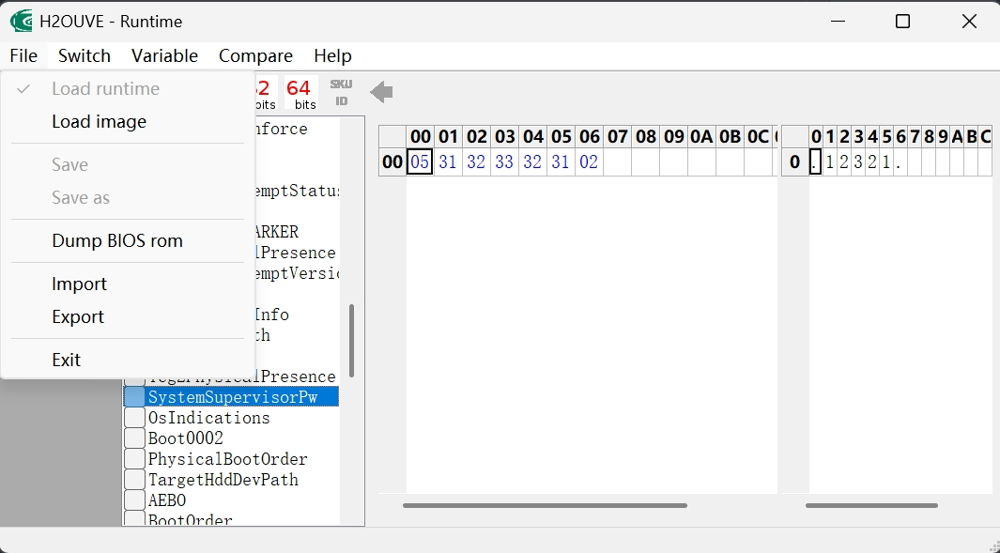

由于笔记本在关闭 Bios 安全启动项之前必须要设置管理员密码，当初草草设置了密码，现在死活想不起来，如果你像我一样也忘记了 Bios 密码，现在可以通过下面的步骤尝试找回。

1. 下载 [Insyde H2OUVE 工具](https://github.com/babybluue/insyde-h2o.git)
2. 先运行 _WDFInst_ 程序，再运行 _H2OUVE-W-GUIx64_
3. File > Load runtime，提取系统 Bios 信息
4. Variable > SystemSupervisorPw，找回 Bios 密码

> [!TIP]
> 变量 SystemSupervisor Pw 左侧栏为 8 进制，右侧栏为 10 进制，8 进制第一位可以理解为字符长度，如 05 表示密码长度为五位，即 12321。
