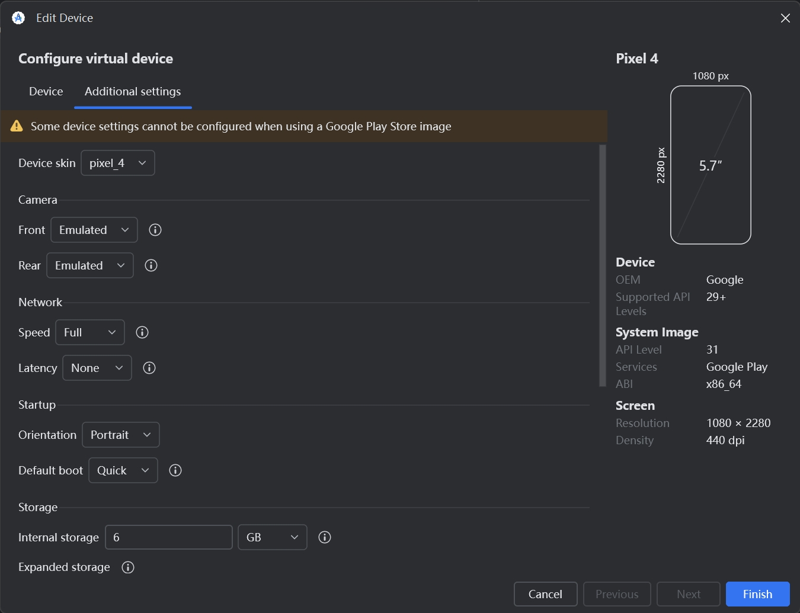

如题，在模拟器调试拍照时，发现后置摄像头的预览没有问题，但是点击拍照时会卡死并且控制台出现下面的错误。

```bash
I/Camera  ( 6877): sending capture request
2
D/CameraCaptureCallback( 6877): CameraCaptureCallback | state: STATE_CAPTURING | afState: 0 | aeState: 2
2
D/CameraCaptureCallback( 6877): CameraCaptureCallback | state: STATE_CAPTURING | afState: 0 | aeState: 5
I/Camera  ( 6877): unlockAutoFocus
I/Camera  ( 6877): refreshPreviewCaptureSession
D/CameraCaptureCallback( 6877): CameraCaptureCallback | state: STATE_CAPTURING | afState: 0 | aeState: 5
I/Camera  ( 6877): open | onError
I/Camera  ( 6877): close
I/Camera  ( 6877): open | onClosed
```

这是模拟器的问题，Android Studio > Device Manager > Android Emulator > Edit > Additional Settings > Camera，根据路径找到模拟器的编辑页面，设置 Camera Rear 为 Emulated 即可。

